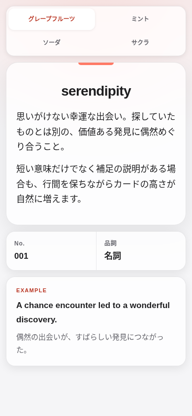

# Ankiカードデザイン

最後に提示されたApple風の表面・裏面・CSSを基にした修正版です。白〜グレーの背景、半透明のカード、丸み、4色のテーマを保ち、答えの量に合わせてカードの高さが増えるようにしています。

## Ankiへの反映

ダウンロードは不要です。GitHubで以下のファイルを開き、内容全体をコピーしてAnkiの「カード…」の対応する欄へ貼り付けてください。既存の内容への追記ではなく、置き換えます。

| ファイル | 貼り付け先 |
| --- | --- |
| [templates/表面.txt](templates/表面.txt) | 表面のテンプレート |
| [templates/裏面.txt](templates/裏面.txt) | 裏面のテンプレート |
| [templates/CSS.txt](templates/CSS.txt) | スタイル |

差し替える前に元の3つの内容を控えておき、差し替え後に短い答えと長い答えをプレビューして確認してください。

フィールド名は `表面`、`裏面`、`単語番号`、`品詞`、`例文1`、`日本語訳1` のままです。フィールドの追加は不要です。

GitHub上では各ファイルの鉛筆アイコン（Edit this file）から編集できます。リポジトリの変更はAnkiに自動反映されないので、変更後の内容をAnkiにも貼り付けてください。

## 修正した動作

- メインカード、単語情報、例文の高さを本文に合わせます。本文を隠す `overflow: hidden` は使いません。
- 短い答えは中央・テーマ色のまま。40文字を超える答えや箇条書き・表などは左揃えの本文色にして、1.7倍の行間を確保します。長い答えでも文字を際限なく縮めません。
- カードの最大幅は現在の540pxです。短いカードの最低高さ210px（スマホでは190px）は保ち、長いカードは下へ広げます。画面より長くなったら画面全体を縦にスクロールして読めます。
- 画像・動画はカードの幅に収めます。幅広の表は表の中だけを横スクロールできます。
- 引用符、改行用のHTML、段落、箇条書きを保ちます。答えのHTMLは隠れた要素からそのまま移動するので、JavaScriptの文字列に埋め込みません。
- 裏面でもテーマ切替と表面の文字サイズを初期化します。表面のスクリプトが裏面で実行されなくても動きます。
- 空の答えや空の改行タグだけの答えは余分な隙間を作りません。例文・日本語訳が空なら対応する表示を省きます。
- 420px以下では色切替を2列にして、ボタン名を省略せず表示します。44px以上の高さとキーボードのフォーカス表示を確保しています。
- 明るい装飾色は保ち、小さいテーマ名やラベルには読みやすい文字色を使います。ダークモードと動きを減らす設定にも対応しています。
- 外部フォント・WebライブラリはAnkiカードに読み込みません。

HTMLでは生の改行だけは改行表示になりません。改行はAnkiのフィールドエディタで入力した ` ` や段落を使ってください。

## 表示例

サンプルノートをブラウザで表示した画像です。ユーザーのデッキ内容は変更していません。

[デスクトップ表示](docs/preview-desktop.png) / [ダークモード表示](docs/preview-dark.png)

## 導入したデザインスキル

リポジトリ内の `.agents/skills/` に、公開元のスキル本体・検索データ・参考資料・必要なスクリプトを導入しました。

| スキル | 導入先 | 公開元 |
| --- | --- | --- |
| UI/UX Pro Max | [.agents/skills/ui-ux-pro-max/SKILL.md](.agents/skills/ui-ux-pro-max/SKILL.md) | [nextlevelbuilder/ui-ux-pro-max-skill](https://github.com/nextlevelbuilder/ui-ux-pro-max-skill) |
| Impeccable | [.agents/skills/impeccable/SKILL.md](.agents/skills/impeccable/SKILL.md) | [pbakaus/impeccable](https://github.com/pbakaus/impeccable) |

公開元のコミットは各スキルの `UPSTREAM.md` に記録し、ライセンスも同梱しています。Impeccableはコンテキスト確認と手動のデザイン検査に使いました。自動フックやグローバル設定は追加していません。初回のエンジン起動時は、公開元のバイナリとSHA-256を取得・照合します。

今回の見た目と使いやすさの方針は [DESIGN.md](DESIGN.md) に記録しています。

## 検証

Chromiumで、320・390・480・768・1024px幅、横向き、200%拡大、ライト／ダーク表示を確認しました。長文・段落・箇条書き・長い連続文字列・引用符・後から読み込まれる画像・幅広の表・空のフィールドを検証し、カードの伸縮と下の枠との重なりがないことを確認しています。

表裏を別の画面として読み込む場合の色の保持、保存領域が利用できない場合の操作、キーボード操作、動きを減らす設定も確認済みです。JavaScriptエラーはありません。詳細と静的検査の指摘の扱いは [docs/validation.md](docs/validation.md) を参照してください。

Anki本体・AnkiMobile・AnkiDroidでの実機確認は、この環境では行っていません。貼り替え後は利用中のAnkiのプレビューでも確認してください。
