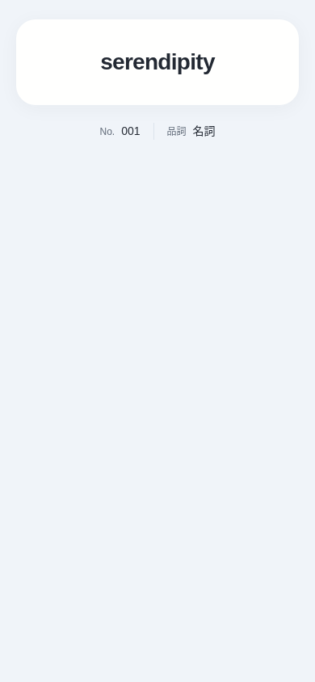

# Ankiカードデザイン

淡い青灰色と白を使った、Apple風のAnkiテンプレートです。Happy Huesの配色を参考に、Impeccableで書体・余白・情報の階層を整えています。**表面から裏面へ切り替えると、答えの分だけ同じ枠が下へ広がります。**

## Ankiへの反映

GitHubで次の3ファイルを開き、内容全体をコピーしてAnkiの「カード…」に貼り付けてください。3つとも既存の内容を置き換えます。CSSへの追記では古い高さ指定などが残るため、スタイルも丸ごと差し替えてください。

| ファイル | 貼り付け先 |
| --- | --- |
| [templates/表面.txt](templates/表面.txt) | 表面のテンプレート |
| [templates/裏面.txt](templates/裏面.txt) | 裏面のテンプレート |
| [templates/CSS.txt](templates/CSS.txt) | スタイル |

差し替える前に元の内容を控え、差し替え後に短い答えと長い答えをプレビューしてください。リポジトリの変更はAnkiに自動反映されません。

フィールドは `表面`、`裏面`、`単語番号`、`品詞`、`例文1`、`日本語訳1` のままです。フィールドの追加は不要です。参考ファイルのレベル・出典・例文2〜6は、現在のノートにないため追加していません。

## 表面と裏面の違い

| 表面 | 答えを表示した裏面 |
| --- | --- |
|  |  |

サンプルノートの表示例です。ユーザーのデッキ内容は変更していません。[デスクトップ](docs/preview-desktop.png) / [ダークモード](docs/preview-dark.png)

## 表示の動作

- 色切替のボタン・保存処理はありません。淡い青灰色の背景に、丸い白いカードと薄い影を使います。
- 書体はシステムのサンセリフ体に統一し、文字の大きさ・太さ・余白で問題と答えを整理しています。
- 問題と答えの枠に最低高さ・高さの上限を設けません。短い答えでも枠が伸び、長い答えや画像が入るとさらに広がります。
- 答えは問題の下に、区切り線と「答え」のラベルを付けて表示します。空の答えでは線・ラベル・余白を出しません。
- 40文字を超える答えや箇条書き・表は、左揃えと広めの行間で表示します。高さに合わせて文字を際限なく縮めません。
- 単語情報は枠の下にコンパクトな一行で表示し、例文は裏面だけに表示します。
- 画像は枠の幅に収めます。幅広の表は表の中だけを横スクロールでき、長いカードは画面全体を縦スクロールして読めます。
- ダークモードはOSとAnkiの設定に応じて自動で切り替わります。
- 外部フォントやWebライブラリの読み込みは不要です。

答えのHTMLは、フィールドをJavaScriptの文字列に埋め込まずに移動します。引用符、段落、箇条書き、` ` による改行も使えます。生の改行だけではHTML上の改行にはならないため、Ankiのフィールドエディタで改行してください。

## 検証と編集

ブラウザで、**表示済みの表面の枠を保持したまま答えを追加し、高さが増えること**を確認しました。320〜1024px幅、長文、画像、空の答え、200%拡大、横向き、ダークモードも確認済みです。[検証結果](docs/validation.md)

Anki本体・AnkiMobile・AnkiDroidでの実機確認は未実施です。貼り替え後は利用中のAnkiのプレビューでも確認してください。

GitHubでは各ファイルの鉛筆アイコンから編集できます。[デザイン方針](DESIGN.md) と、導入済みの [UI/UX Pro Max](.agents/skills/ui-ux-pro-max/SKILL.md) / [Impeccable](.agents/skills/impeccable/SKILL.md) もリポジトリにあります。

配色は[Happy Hues](https://www.happyhues.co/)由来の[公開パレットデータ](https://github.com/meodai/happyHuesColors/blob/32eb0d8078c83475721745358d5b06495fc137b0/dist/palettes.json)を参考にしています。本家サイトは作業環境から直接閲覧できなかったため、このデータで色を確認しました。採用色と調整した色は[デザイン方針](DESIGN.md)に記載しています。
